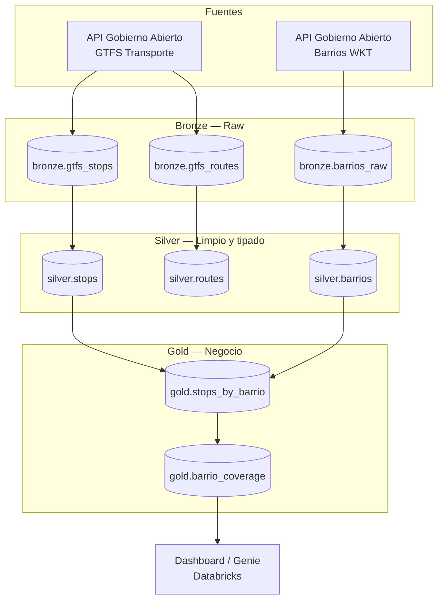

# Pipeline de Cobertura de Transporte Público — Córdoba, Argentina

## Pregunta de negocio

> **¿Qué barrios de la ciudad de Córdoba tienen peor cobertura de transporte público urbano, medida en densidad de paradas por km²?**

Esta pregunta guía el diseño de la capa Gold. Es intencionalmente específica y medible: no es "analizar el transporte" en abstracto, sino una métrica concreta (paradas / área) que permite rankear y visualizar barrios.

## Fuentes de datos

| Fuente | Dataset | Formato | Endpoint base |
|---|---|---|---|
| Municipalidad de Córdoba — Gobierno Abierto | GTFS Transporte Público (id `3319`) | ZIP (GTFS estándar: `stops.txt`, `routes.txt`, `trips.txt`, etc.) | `api/datos-abiertos/dato/3319` |
| Municipalidad de Córdoba — Gobierno Abierto | Barrios de la ciudad (id `118`) | CSV con geometría WKT | `api/datos-abiertos/dato/118` |

Ambas fuentes se resuelven vía la misma cadena de 4 niveles de la API municipal (categoría → dato → versión → recurso), que entrega URLs firmadas de S3 con expiración de 1 hora. El pipeline debe resolver la URL en cada corrida, no cachearla.

## Arquitectura general

Orquestado con **Databricks Workflows**: un job con tareas encadenadas (`ingest_gtfs` → `ingest_barrios` → `transform_silver` → `spatial_join_gold`), con dependencias explícitas entre tareas y corrida programada (ej. semanal, ya que son datos que no cambian a diario).

## Esquema por capa

### a_bronze

Ingesta cruda, sin transformar, con metadata de trazabilidad. Cada tabla agrega estas columnas de auditoría además de los datos originales:

| Columna | Tipo | Descripción |
|---|---|---|
| `_ingested_at` | timestamp | Momento de la ingesta |
| `_source_dataset_id` | string | ID del dataset en la API municipal (ej. `3319`) |
| `_source_url` | string | URL resuelta (sin el token de firma, por seguridad) |

**`bronze.gtfs_stops`** (de `stops.txt` dentro del GTFS)
| Columna | Tipo |
|---|---|
| stop_id | string |
| stop_name | string |
| stop_lat | double |
| stop_lon | double |
| stop_code | string |

**`bronze.gtfs_routes`** (de `routes.txt`)
| Columna | Tipo |
|---|---|
| route_id | string |
| route_short_name | string |
| route_long_name | string |
| route_type | int |

**`bronze.barrios_raw`** (del CSV con WKT)
| Columna | Tipo |
|---|---|
| barrio_id | string |
| nombre | string |
| tipo_barrio | string |
| geometry_wkt | string |

### b_silver

Datos limpios, tipados, deduplicados. Las geometrías se parsean a tipo geoespacial real (vía Shapely) en lugar de quedar como texto.

**`silver.stops`**
| Columna | Tipo | Nota |
|---|---|---|
| stop_id | string (PK) | |
| stop_name | string | trim, normalizado |
| geometry | geometry (point) | parseado de lat/lon |

**`silver.barrios`**
| Columna | Tipo | Nota |
|---|---|---|
| barrio_id | string (PK) | |
| nombre | string | normalizado (mayúsculas/tildes consistentes) |
| tipo_barrio | string | "oficial" / "no oficial" |
| geometry | geometry (polygon) | parseado de WKT |
| area_km2 | double | calculada desde la geometría |

### c_gold

**`gold.stops_by_barrio`** (resultado del spatial join point-in-polygon)
| Columna | Tipo |
|---|---|
| stop_id | string |
| barrio_id | string |
| barrio_nombre | string |

**`gold.barrio_coverage`** (tabla que responde la pregunta de negocio)
| Columna | Tipo | Descripción |
|---|---|---|
| barrio_id | string | |
| barrio_nombre | string | |
| area_km2 | double | |
| cantidad_paradas | int | |
| paradas_por_km2 | double | métrica principal |
| ranking_cobertura | int | 1 = mejor cubierto |

## Stack técnico

- **Ingesta**: Python `requests` (resolución de la cadena de API + descarga de ZIP/CSV)
- **Transformación**: PySpark / Spark SQL para Bronze→Silver
- **Join espacial**: GeoPandas + Shapely en la capa Gold (se baja a pandas para esta operación puntual, ya que Spark no tiene soporte geoespacial nativo sin librerías adicionales como Sedona)
- **Almacenamiento**: Delta Lake (todas las capas)
- **Orquestación**: Databricks Workflows
- **Consumo**: Databricks Dashboard o Genie space

## Extensibilidad — cómo se agregan nuevas preguntas

El diseño en capas está pensado para esto. Reglas prácticas:

1. **Nueva pregunta que usa las mismas fuentes** (ej. "¿qué líneas de colectivo tienen más paradas por km recorrido?"): solo agregás una tabla nueva en Gold (ej. `gold.route_density`) que lee de las tablas Silver ya existentes. No tocás Bronze ni Silver.
2. **Nueva pregunta que necesita una fuente nueva** (ej. cruzar con "Cortes de boleto y km recorridos" para medir demanda real, no solo cobertura geográfica): agregás una tabla Bronze nueva siguiendo el mismo patrón de columnas de auditoría, su transformación a Silver, y una tabla Gold que la cruce con lo que ya existe.
3. **Regla de oro**: Silver nunca se "ensucia" con lógica de negocio — ahí solo va limpieza y tipado. Toda pregunta nueva vive en Gold. Así el historial de decisiones de negocio queda separado de la limpieza técnica, y podés tener 10 preguntas de negocio sin duplicar 10 veces el trabajo de ingesta.
